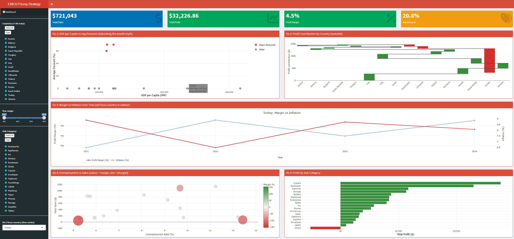

# EMEA Pricing Strategy Dashboard

An interactive R Shiny dashboard that answers one business question: why does a global retailer's Europe, Middle East and Africa (EMEA) market earn a profit margin of only 5.4% on more than $800,000 of sales, when every other market earns 10 to 27%? The dashboard joins the retailer's own transactions with World Bank economic indicators to test two competing explanations, and shows that the losses are a pricing decision made inside the company, concentrated in three countries, rather than a consequence of the region's economies.

| | |
|---|---|
| **Author** | Ian Leong Zheng Yan |
| **Unit** | ETW2001 Foundations of Data Analysis, Monash University Malaysia, Assignment 2 |
| **Period** | May 2026 |
| **Stack** | R, Shiny, shinydashboard, Plotly, ggplot2, dplyr, tidyr, readxl |



## The question

Two stories could explain the thin margin, and they lead to opposite actions.

- **Economic.** EMEA contains many developing and unstable economies, so the company is forced to discount heavily to sell at all. If true, thin margins are the cost of operating there and should be accepted.
- **Operational.** The losses come from a discounting policy applied in a few specific countries regardless of their economy. If true, the fix is to change the pricing.

The test is direct. If the economic story holds, the poorer and less stable countries should carry the deepest discounts and losses. If the operational story holds, the losses will sit in a small number of countries unrelated to their economic health.

## Data

| Source | Dataset | Used for |
|---|---|---|
| Superstore (retail transactions) | 5,029 EMEA transactions across 40 countries, 2011 to 2014: country, year, sales, profit, discount, sub-category | The internal picture: what is sold, where, at what discount and profit |
| World Bank | GDP per capita, PPP (NY.GDP.PCAP.PP.CD) | Consumer purchasing power |
| World Bank | Inflation, consumer prices (FP.CPI.TOTL.ZG) | Cost-of-living pressure |
| World Bank | Unemployment, % of labour force (SL.UEM.TOTL.ZS) | Economic stress |

The three indicators are reshaped from wide to long, filtered to the 40 EMEA countries, joined to each other and then left-joined to the transactions on country and year. Country names are reconciled between the two naming conventions (for example "Russian Federation" to "Russia"). Three countries lack complete World Bank coverage and are dropped from the economic charts; they hold about 2% of rows and none are loss-making.

## What the dashboard shows

Four KPI boxes (sales, profit, margin, average discount) and five linked charts, all filterable by country, year range and product sub-category.

| Chart | Idiom | Finding |
|---|---|---|
| GDP per capita vs average discount | Scatter | No relationship between wealth and discounting. Thirteen of sixteen countries sit at zero discount across the full wealth range. Only Turkey (60%), Lithuania and Kazakhstan (70%) discount at all, and they are middle-income, not the poorest. |
| Profit contribution by country | Waterfall | Healthy countries build the regional profit; Turkey then erases almost all of it in one drop of about $98,000, roughly 86% of all EMEA losses. |
| Margin vs inflation over time | Time series (focus country) | Turkey's margin stays deeply negative across all four years regardless of inflation movements. |
| Unemployment vs sales | Bubble (colour = margin) | Loss-making countries are not the high-unemployment ones. |
| Profit by sub-category | Bar | The losses are spread across product lines, so this is not a bad-product problem. |

Conclusion: the economic explanation is rejected. The region's losses are operational, caused by a heavy blanket discount in three countries, and the recommended action is to review that discounting policy starting with Turkey.

## Run it

Requires R 4.x and RStudio (or the `shiny` package from the console).

```r
install.packages(c("shiny", "shinydashboard", "ggplot2", "plotly", "dplyr",
                   "tidyr", "readr", "readxl", "scales"))
```

1. Open `data_prep.R` and run it. It reads `data/superstore.xlsx` and the three World Bank CSVs and writes `shiny_master_data.csv` (the file the app reads, git-ignored, about 1.4 MB).
2. Open `app.R` and click Run App, or run `shiny::runApp()` from the project folder.

The R scripts expect the data files in the working directory; copy or symlink the contents of `data/` next to the scripts, or set the working directory to `data/` after moving the scripts there.

`scripts/` holds the Python exploration used before the R pipeline was written: a dataset profile, the EMEA country list and the World Bank cleaning prototype. They are kept for the record and are not needed to run the dashboard.

## Repository layout

```
emea-pricing-dashboard/
├── app.R              Shiny UI and server
├── data_prep.R        reproducible data preparation, writes shiny_master_data.csv
├── data/              superstore.xlsx and the three World Bank indicator files
├── docs/Report.pdf    the written report submitted with the dashboard
├── docs/*.png         dashboard and chart screenshots
└── scripts/           early Python exploration
```

## Data sources

- Superstore sample dataset (Tableau), global retail transactions 2011 to 2014.
- World Bank Open Data: GDP per capita PPP (2023), Inflation consumer prices (2024), Unemployment total modelled ILO estimate (2025). https://data.worldbank.org
